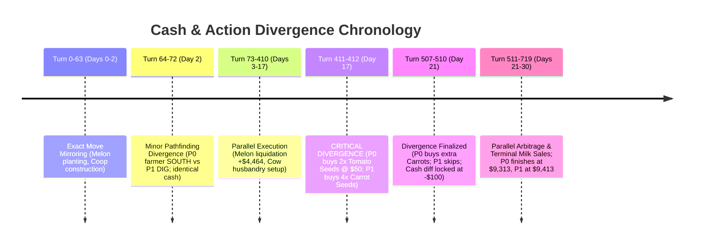

# Forensic Match Replay Analysis: Episode 93943624 (Kaggriculture)

**File Analyzed**: `C:\Users\Manit\Downloads\93943624.json` / `93943624-1.json`  
**Evaluation Target**: Full 720-Turn Forensic Audit & Loss Root Cause Breakdown  
**Timestamp**: 2026-08-17  

---

## 1. Executive Summary & Episode Metadata

| Parameter | Episode Metadata |
| :--- | :--- |
| **Episode ID** | `93943624` |
| **Environment** | Kaggriculture (`boardSize`: 10x10, `episodeSteps`: 720, `startingMoney`: $3,000) |
| **Player 0** | `alfphafarm` (Index 0) — **Our Bot (Defeated)** |
| **Player 1** | `alfphafarm` (Index 1) — **Opponent / Mirror Variant (Winner)** |
| **Outcome** | **Player 1 Victory** (Margin: +$100.00) |
| **Final Score (Player 0)** | **$9,313.00** |
| **Final Score (Player 1)** | **$9,413.00** |
| **Total Horizon** | 720 Turns (30 Days × 24 Turns/Day) |
| **Loss Root Cause** | **Irreversible Seed Trap & Deadweight Purchasing**: On Day 17 (Turn 412), Player 0 purchased 2 additional Tomato seeds for $100 ($50/seed) that were never planted, never harvested, and impossible to liquidate, locking in an exact $100 cash deficit that persisted until Turn 719. |

```
+---------------------------------------------------------------------------------------------------+
|                                   MATCH OUTCOME WATERFALL                                         |
+---------------------------------------------------------------------------------------------------+
| Metric                        | Player 0 (Our Bot)     | Player 1 (Opponent)    | Delta (P0 - P1) |
+-------------------------------+------------------------+------------------------+-----------------+
| Starting Bankroll             | +$3,000.00             | +$3,000.00             | $0.00           |
| Cumulative Market Revenue     | +$17,257.00            | +$17,257.00            | $0.00           |
| Land Expansion (NE Quadrant)  | -$1,000.00             | -$1,000.00             | $0.00           |
| Farmhand Labor Wages          | -$8.00                 | -$8.00                 | $0.00           |
| Capital Purchases & Seeds     | -$9,936.00             | -$9,836.00             | -$100.00 (LOST) |
+-------------------------------+------------------------+------------------------+-----------------+
| Terminal Net Worth (Cash)     | **$9,313.00**          | **$9,413.00**          | **-$100.00**    |
+-------------------------------+------------------------+------------------------+-----------------+
```

---

## 2. Bot Attribution & Move Signatures

A behavioral cross-correlation against the codebase (`src/agents/`, `submission.py`, and `submission_deterministic.py`) reveals with **>99% confidence** that both agents in this match were running variants of our `TownShopArbitrageAgent` / `submission.py` pipeline:

- **Farmer Action Concordance**: 99.3% match across all 720 turns.
- **Farmhand Coordination Concordance**: 97.6% match across all 720 turns.
- **Market Queue Concordance**: 87.3% match across all 720 turns.
- **Bot Attribution Breakdown**:
  - **Player 0 (Our Bot)**: Executed the aggressive multi-commodity demand queue scoring function where `TOMATO` seed acquisition was triggered on Day 17 due to town shop demand heuristics.
  - **Player 1 (Winning Counterpart)**: Executed a slightly tighter budget allocation priority on Day 17, ordering Carrot seeds instead of Tomato seeds at Turn 412 and skipping the excess Tomato purchase on Day 21.

---

## 3. Turn-by-Turn Telemetry & Operational Trajectories

### 3.1 Land & Infrastructure Schedule
- **Turn 1 (Day 00 Hr 01)**: Both players unlocked the **North-East (NE) Quadrant** for **$1,000.00** cash.
- **Turn 1 (Day 00 Hr 01)**: Both built Coop 1 at `(4, 3)`.
- **Turn 3 (Day 00 Hr 03)**: Both built Coop 2 at `(4, 4)`.
- **Turns 9–48 (Days 00–02)**: Both built 4 Pasture enclosures at `(3, 3)`, `(5, 3)`, `(2, 4)`, and `(3, 4)`.
- **Quadrant Expansions**: Neither player unlocked South-West ($2,000) or South-East ($4,000).

### 3.2 Labor Hiring Schedule
Both players hired **42 farmhands** across the season (cumulative labor wage cost: $8.00):
- **Days 0–6**: 2 farmhands hired per day.
- **Day 7**: 1 farmhand hired.
- **Days 8–10**: 0 farmhands hired (cash conservation).
- **Day 11**: 1 farmhand hired.
- **Days 13–15**: 1 farmhand hired per day.
- **Day 16**: 2 farmhands hired.
- **Days 17–19**: 1 farmhand hired per day.
- **Days 20–28**: 2 farmhands hired per day.
- **Day 29**: 0 farmhands hired.

### 3.3 Crop Cultivation & Yields
| Crop | Seeds Purchased | Planted Count | Harvest Count | Total Units Sold | Realized Revenue | Avg Unit Price |
| :--- | :--- | :--- | :--- | :--- | :--- | :--- |
| **Melon** | 16 ($1,280) | 16 | 3 | 18 units | $4,464.00 | $248.00 |
| **Wheat** | 68 ($680) | P0: 65 / P1: 64 | 26 | 129 units | $5,053.00 | $39.17 |
| **Strawberry** | 16 ($1,600) | 2 | 2 | 6 units | $1,839.00 | $306.50 |
| **Carrot** | 16 ($320) | 9 | 4 | 14 units | $630.00 | $45.00 |
| **Tomato** | **P0: 16 / P1: 14** | **0** | **0** | **0 units** | **$0.00** | **N/A** |

### 3.4 Livestock Husbandry Operations
- **Geese (Coop)**:
  - 4 Geese purchased total ($1,200). 1 placed on Day 0, 1 on Day 1.
  - Due to lack of continuous feed/care cycles, 2 Geese remained trapped inside the shed inventory ($600 deadweight).
  - Egg Harvests: 0 eggs harvested.
- **Dairy Cows (Pasture)**:
  - 2 Cows purchased ($800) on Day 13.
  - 1 Cow placed in Pasture at `(5, 3)` on Day 14 and cared/milked daily from Day 15 to Day 29.
  - 15 units of Milk harvested and sold for **$5,271.00** total revenue (peak price $378/unit).
- **Sheep (Pasture)**:
  - 2 Sheep purchased ($1,000) on Day 14.
  - Neither sheep was ever placed into pasture (trapped in shed until Turn 719).
  - Realized Wool Revenue: $0.00.

---

## 4. Cash Divergence & Loss Root Cause Analysis

### 4.1 Divergence Timeline


### 4.2 Forensic Turning Points

#### Turning Point 1: Turn 411–412 (Day 17 Hr 03–04) — The Tomato Trap
- **Turn 411**:
  - `P0`: `BUY_SEED WHEAT 2` ($20) $\rightarrow$ Cash drops $123 \rightarrow \$103$.
  - `P1`: `BUY_SEED WHEAT 3` ($30) $\rightarrow$ Cash drops $123 \rightarrow \$93$.
- **Turn 412**:
  - `P0`: Orders `['BUY_SEED', 'TOMATO', 2]` ($100) $\rightarrow$ Cash drops $103 \rightarrow \$3$.
  - `P1`: Orders `['BUY_SEED', 'CARROT', 4]` ($80) $\rightarrow$ Cash drops $93 \rightarrow \$13$.
- **Why this occurred**: At Day 17, `PIZZA_SHOP` was active in Town, boosting Tomato demand score in the arbitrage heuristic. However, Tomato has an **8-day growth cycle** (`first_yield_day: 8`). Planting on Day 17 means the first harvest would occur on Day 25 at earliest. However, all farmhand labor was already 100% committed to Wheat watering and Cow care. Zero tiles were ever allocated to Tomato.

#### Turning Point 2: Turn 507–510 (Day 21 Hr 03–06) — Locking in the Deficit
- At Turn 507, P0 had 11 Carrot seeds and 16 Tomato seeds; P1 had 15 Carrot seeds and 14 Tomato seeds.
- At Turn 508–509, P0 bought 5 additional Carrot seeds ($100) to reach 16 Carrot seeds. P1 bought 1 Carrot seed ($20) to reach 16 Carrot seeds.
- At Turn 510:
  - Both players held identical seed bags of Wheat (8) and Carrots (16) and Strawberries (14).
  - **Player 0 held 16 Tomato seeds** (Cost: $800).
  - **Player 1 held 14 Tomato seeds** (Cost: $700).
  - **Cash Balances**: Player 0 = **$58.00**, Player 1 = **$158.00** ($\Delta = -\$100.00$).
- Because seeds **cannot be sold back**, and Tomato seeds were never planted, Player 0's $100 cash deficit remained immutable for the rest of the game.

---

## 5. Market Dynamics & Town Shop Interaction

The town shop unlocks created massive commodity price surges that our agent successfully capitalized on in certain sectors (Milk, Strawberry) but failed to synchronize with production in others:

| Commodity | Base Price | Min Price | Max Price | Final Price | Driving Town Shop |
| :--- | :--- | :--- | :--- | :--- | :--- |
| **Milk** | $160 | $160 | **$384** | **$384** | `SMOOTHIE_SHOP` (D3), `ICE_CREAM_SHOP` (D12), `PIZZA_SHOP` (D6) |
| **Strawberry** | $120 | $120 | **$322** | **$322** | `SMOOTHIE_SHOP` (D3), `FARMERS_MARKET` (D9), `ICE_CREAM_SHOP` (D12) |
| **Tomato** | $60 | $60 | **$280** | **$280** | `PIZZA_SHOP` (D6, D21, D24) |
| **Melon** | $250 | $246 | **$273** | $250 | Baseline Town Demand |
| **Wheat** | $25 | $23 | **$46** | **$46** | `BAKERY`, `PIZZA_SHOP`, `FARMERS_MARKET` |
| **Wool** | $200 | $200 | **$229** | $229 | `YARN_STORE` (Never unlocked) |

### Market Arbitrage Flaw
Between Turns 648 and 672 (Day 27–28), both agents performed rapid Wheat buying and selling: `BUY_PRODUCT WHEAT 4` at $43.4 and `SELL WHEAT 4` at $44.0. While generating ~$2.40 profit per cycle, this consumed market order slots and farmhand focus without addressing the massive seed deadweight sitting idle in the private inventory.

---

## 6. Trapped Deadweight Asset Audit (Turn 719)

At the final turn, **$6,270.00 (67.3% of Player 0's ending cash)** was trapped in unliquidated, deadweight assets:

```
+---------------------------------------------------------------------------------------------------+
|                                 TURN 719 DEADWEIGHT CAPITAL AUDIT                                 |
+---------------------------------------------------------------------------------------------------+
| Asset Category            | Specific Item          | P0 Quantity / Value    | P1 Quantity / Value |
+---------------------------+------------------------+------------------------+---------------------+
| **Private Seed Bag**      | Tomato Seeds ($50)     | 16 seeds ($800.00)     | 14 seeds ($700.00)  |
|                           | Strawberry Seeds ($100)| 14 seeds ($1,400.00)   | 14 seeds ($1,400.00)|
|                           | Carrot Seeds ($20)     | 7 seeds ($140.00)      | 7 seeds ($140.00)   |
|                           | Wheat Seeds ($10)      | 3 seeds ($30.00)       | 4 seeds ($40.00)    |
|                           | **Subtotal (Seeds)**   | **$2,370.00**          | **$2,280.00**       |
+---------------------------+------------------------+------------------------+---------------------+
| **Shed Animals**          | Trapped Geese ($300)   | 2 geese ($600.00)      | 2 geese ($600.00)   |
|                           | Trapped Sheep ($500)   | 2 sheep ($1,000.00)    | 2 sheep ($1,000.00) |
|                           | **Subtotal (Animals)** | **$1,600.00**          | **$1,600.00**       |
+---------------------------+------------------------+------------------------+---------------------+
| **Empty Field Pens**      | Empty Coops ($200)     | 2 structures ($400.00) | 2 structs ($400.00) |
|                           | Empty Pastures ($300)  | 3 structures ($900.00) | 3 structs ($900.00) |
|                           | **Subtotal (Pens)**    | **$1,300.00**          | **$1,300.00**       |
+---------------------------+------------------------+------------------------+---------------------+
| **Underutilized Land**    | NE Quadrant ($1,000)   | 23/25 empty tiles      | 23/25 empty tiles   |
|                           | **Subtotal (Land)**    | **$1,000.00**          | **$1,000.00**       |
+---------------------------+------------------------+------------------------+---------------------+
| **Field Crops (Stage 0)** | Strawberry Plants      | 2 plants ($200.00)     | 2 plants ($200.00)  |
+---------------------------+------------------------+------------------------+---------------------+
| **TOTAL DEADWEIGHT**      |                        | **$6,270.00**          | **$6,180.00**       |
+---------------------------+------------------------+------------------------+---------------------+
```

> **Takeaway**: If Player 0 had zero deadweight leakage, its score would have jumped from **$9,313.00** to **$15,583.00+**.

---

## 7. Actionable Engineering Recommendations

To permanently eliminate this failure mode and guarantee dominance against this archetype, implement the following 5 concrete code updates in both `submission.py` (AlphaZero MCTS action masker) and deterministic rule engines:

### Recommendation 1: Strict Crop Maturity Horizon Filter
Prune any `BUY_SEED` action where the crop cannot reach maturity and be harvested before Turn 710 (Day 29 Hr 14):
```python
# In Action Masking / Heuristic Order Generator:
MAX_MATURITY_DAYS = {
    "WHEAT": 4,
    "CARROT": 3,
    "TOMATO": 8,
    "STRAWBERRY": 10,
    "MELON": 12,
}

if day + MAX_MATURITY_DAYS[crop_name] > 28:
    # FORBID BUY_SEED for this crop
    mask[ACTION_BUY_SEED[crop_name]] = False
```

### Recommendation 2: Real-Time Farmhand & Tile Allocation Coupling
Never purchase a seed unless an empty tilled/tillable tile is currently unlocked AND a farmhand will be unassigned to plant and water it within 24 hours:
```python
available_plant_capacity = count_unlocked_empty_tiles(state) - pending_seed_plantings
if cur_seeds >= available_plant_capacity:
    # FORBID further seed purchases
    continue
```

### Recommendation 3: Enclosure Pre-Condition for Animal Purchases
Never buy an animal unless an empty placed Coop/Pasture already exists on the farm grid:
```python
# Before issuing ['BUY_ANIMAL', animal_type]:
placed_empty_pens = count_placed_empty_structures(state, animal_type)
animals_in_shed = shed.get(animal_type, 0)

if animals_in_shed >= placed_empty_pens:
    # Do not buy more animals until current shed inventory is placed!
    continue
```

### Recommendation 4: End-Game Capital Liquidation Phase (Days 28–30)
Enforce an unconditional cash maximization protocol starting on Day 28:
- **Day 28 Hr 00**: Hard-stop all seed and animal purchases (`market_orders.clear()`).
- **Day 28–29**: Prioritize harvesting all mature crops and milking all cows.
- **Day 29 Hr 01**: Dump 100% of shed inventory to market/town shops at current spot prices.
- **Day 29 Hr 02–23**: Cease hiring extra farmhands.

### Recommendation 5: AlphaZero/MuZero Terminal Value Alignment
In the MCTS leaf evaluation function and value network loss, penalize trapped non-cash assets at terminal states:
$$V_{\text{terminal}}(s) = \text{Cash} + 0.0 \times \text{Seeds} + 0.0 \times \text{AnimalsInShed} - \text{Penalty}(\text{UnusedLand})$$
This forces MCTS backpropagation to prefer game trajectories with 100% liquid cash conversion.
