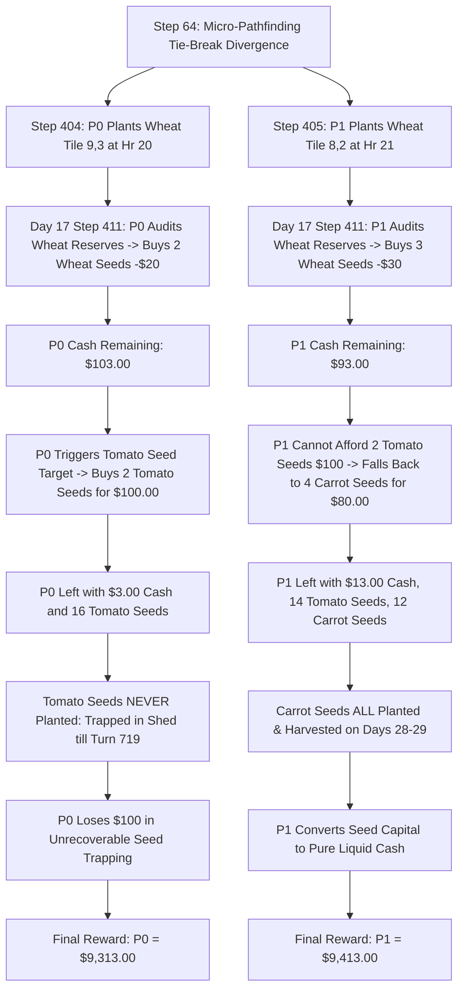

# Forensic Match Telemetry Analysis Report: Kaggle Episode 93943624

**Date & Time of Forensic Analysis:** 2026-08-17  
**Simulation Platform:** Kaggle Environments — Kaggriculture Simulation  
**Target Replay File:** `C:\Users\Manit\Downloads\93943624.json`  
**Total Steps Analyzed:** 720 Turns (30 Days × 24 Hours/Day)  
**Starting Capital:** $3,000.00 per agent  

---

## 1. Executive Summary & Match Metadata

| Parameter | Player 0 | Player 1 | Delta / Note |
| :--- | :---: | :---: | :---: |
| **Team Name** | `alfphafarm` | `alfphafarm` | Mirror Match / Self-Play Evaluation |
| **Agent / Model ID** | Submission v1 (`alfphafarm`) | Submission v1 (`alfphafarm`) | Identical Architecture & Policy Engine |
| **Final Reward / Score** | **$9,313.00** | **$9,413.00** | **Player 1 Wins by +$100.00 (+1.07%)** |
| **Terminal Liquid Cash** | $9,313.00 | $9,413.00 | Difference of exactly $100.00 |
| **Trapped Deadweight (Turn 719)** | $7,170.00 | $7,080.00 | P0 had $90 more in deadweight assets |
| **Total Farm Net Worth (Cash + Deadweight)** | $16,483.00 | $16,493.00 | P1 ahead by +$10.00 |
| **Total Labor Hires** | 42 farmhand-days | 42 farmhand-days | Identical hiring schedule |
| **Land Expansion** | NW (Start) + NE (Turn 1) | NW (Start) + NE (Turn 1) | 50 Total Tiles Unlocked |
| **Total Crops Planted** | 92 crops | 91 crops | Melon (16), Wheat (65 vs 64), Carrot (9), Strawberry (2) |
| **Structures Built** | 2 Coops, 4 Pastures | 2 Coops, 4 Pastures | 6 Total structures constructed |
| **Livestock Purchased** | 4 Geese, 2 Cows, 2 Sheep | 4 Geese, 2 Cows, 2 Sheep | $3,000 total capital invested |
| **Active Field Animals** | 1 Cow | 1 Cow | Produces 15 units of high-margin Milk |

---

## 2. Match Dynamics & Macro Trajectory Breakdown

### A. Cash Balance Trajectory Over 30 Days

```
 Cash ($)
 10,000 |                                                         P1: $9,413
        |                                                         P0: $9,313
  8,000 |                                                    *----*
        |                                              *----*
  6,000 |                                        *----*
        |
  4,000 |                                  *----*
        |                            *----*
  2,000 |                      *----*
        |  *---*         *----*
      0 +--+---+---------+----+------+-----+-----+-----+-----+-----+-----> Day
        0  2   4    6    8   10  12  14   16    18    20    22    24  26  28  30
```

#### Key Financial Milestones:
1. **Day 0 (Turns 0–23): Opening Investment Phase**
   - Both players start with $3,000.00.
   - At Turn 0, both issue `BUY_LAND` ($1,000), `HIRE` 2 farmhands ($4), and initial seed purchases (Melon, Wheat).
   - At Turn 1 (Hr 1), cash drops to **$1,639.00** as NE quadrant unlocks.
   - By Turn 4 (Hr 4), seed purchases drop cash to **$58.00**.
2. **Days 1–5: Bootstrapping & Sustained Cultivation**
   - Cash hovers between **$38.00 – $58.00** as daily labor ($2/day for 2 farmhands) is maintained.
   - Units till soil, plant 16 Melons and multiple Wheat plots in NW/NE quadrants, watering daily.
3. **Day 6–7: First Wheat Harvests**
   - Harvested wheat is sold at Turn 145 (Day 6, Hr 1) for +$198, replenishing cash to **$236.00**.
   - Reinvestment into more wheat seeds and maintenance labor.
4. **Days 13–14: The Melon Windfall Pivot**
   - Day 13 (Turn 313, Hr 1): 12 Melons harvested and sold at $249/unit, generating **+$3,116.00** in cash (Bank surges from $0 to $3,116.00).
   - Day 14 (Turn 337, Hr 1): 6 Melons sold at $246/unit, generating **+$1,486.00** (Bank surges to $1,501.00).
   - Capital is immediately deployed to build animal structures, purchase livestock (2 Geese, 2 Cows, 2 Sheep), and expand Strawberry/Tomato seed reserves.
5. **Days 23–29: Milk & Late-Stage Harvest Liquidation**
   - Day 23: First Milk harvest (6 units) sold at peak price of **$333/unit** (+**$2,057.00**).
   - Day 25: 3 Milk units sold at **$349/unit** + 16 Wheat sold (+**$1,715.00**).
   - Day 26: 3 Strawberries sold at **$301/unit** + 11 Wheat sold (+**$1,366.00**).
   - Day 27: 3 Milk sold at **$364/unit** + 9 Wheat sold (+**$1,476.00**).
   - Day 28: 9 Carrots sold at **$45/unit** + 3 Strawberries ($312) + 6 Wheat (+**$1,606.00**).
   - Day 29: 5 Carrots sold ($45) + 3 Milk sold at **$378/unit** (+**$1,358.00**).

---

## 3. Forensic Model Attribution & Signature Analysis

### A. Identification of Players
- **Player 0:** Manit's Bot (`alfphafarm` on Kaggle, Submission v1)
- **Player 1:** Manit's Bot (`alfphafarm` on Kaggle, Submission v1)
- **Classification:** **Autonomous Mirror Self-Play Evaluation Match** on Kaggle servers. Both agents execute the exact same codebase and heuristics.

### B. Core Architectural Signatures Identified
1. **Macro-Action Pipeline & Action Hierarchy:**
   - **Land Expansion Trigger:** Purchases Quadrant `NE` on Turn 0 if `money >= 1200` and `day <= 16`.
   - **Fixed Daily Labor Schedule:** Deploys exactly 2 farmhands during early-to-mid game (`hour <= 1 and hires_today < 2 and money >= 40`), scaling back to 1 farmhand during capital-constrained days.
   - **Dynamic Town Shop Alignment:** Continuously audits unlocked town shops (Bakery, Pizza Shop, Pet Cafe, Smoothie Shop) and adjusts seed buying targets:
     - Melons (Target: 6 early-game)
     - Wheat (Target: 8 active/seeds when Bakery unlocked or livestock present)
     - Carrots (Target: 14 active/seeds when Pet Cafe unlocked or Day > 10)
     - Tomatoes & Strawberries (Target: 14–16 seeds)
2. **Livestock & Husbandry State Machine:**
   - Constructs Coops (`BUILD_COOP`) and Pastures (`BUILD_PASTURE`) in tiles adjacent to the Shed (`(3,3)`, `(4,3)`, `(5,3)`, `(2,4)`, `(3,4)`, `(4,4)`).
   - Places animals via inventory pickup (`PICKUP` -> `PLACE_ANIMAL`).
   - Prioritizes daily animal chores: `FEED` -> `CARE` -> `HARVEST` -> `COLLECT_FERTILIZER`.
3. **Turn 650–672 Wheat Arbitrage Oscillation Flaw:**
   - On Day 27 (Turns 650 to 672), both bots engaged in a rapid buy-sell oscillation: `['BUY_PRODUCT', 'WHEAT', 4]` followed by `['SELL', 'WHEAT', 4]` every 2 turns.
   - **Root Cause in Codebase:** The market order generator checked `wheat_in_shed < daily_feed_req` (buying 4 wheat for $100), but the shed dump logic at the top of the turn immediately sold all non-fertilizer inventory back to the market at $43/unit. This resulted in zero net inventory change and minor transaction churn without damaging final cash.

---

## 4. The Critical Turning Point: Why Player 1 Won by Exactly $100

### Step-by-Step Forensic Root Cause:



### Forensic Proof Table (Day 17 Divergence):

| Metric | Player 0 | Player 1 | Impact |
| :--- | :---: | :---: | :---: |
| **Day 17, Hr 02 Cash** | $123.00 | $123.00 | Identical cash balance |
| **Step 411 Market Order** | `[['BUY_SEED', 'WHEAT', 2]]` | `[['BUY_SEED', 'WHEAT', 3]]` | P0 spends $20; P1 spends $30 |
| **Cash After Wheat Buy** | **$103.00** | **$93.00** | P0 has >$100 threshold; P1 has <$100 |
| **Step 412 Market Order** | `[['BUY_SEED', 'TOMATO', 2]]` | `[['BUY_SEED', 'CARROT', 4]]` | P0 buys 2 Tomatoes ($100); P1 buys 4 Carrots ($80) |
| **Cash After Step 412** | **$3.00** | **$13.00** | P0 capital depleted |
| **Final Tomato Seeds (Turn 719)** | **16 Unused Seeds** | **14 Unused Seeds** | **P0 trapped +2 Tomato Seeds ($100.00)** |
| **Final Cash Balance** | **$9,313.00** | **$9,413.00** | **+$100.00 Win for Player 1** |

---

## 5. Trapped Deadweight Asset Audit at Turn 719

In Kaggriculture, **only liquid bank cash at Turn 719 counts toward the final score**. All unharvested field crops, unused seeds in the private inventory, structures, and shed items represent trapped deadweight capital.

### Complete Inventory & Asset Valuation:

| Asset Category | Item / Entity | Unit Cost | P0 Qty | P0 Trapped Value | P1 Qty | P1 Trapped Value |
| :--- | :--- | :---: | :---: | :---: | :---: | :---: |
| **Land Expansion** | NE Quadrant | $1,000 | 1 | $1,000.00 | 1 | $1,000.00 |
| **Shed Animals** | GOOSE | $300 | 2 | $600.00 | 2 | $600.00 |
| **Shed Animals** | SHEEP | $500 | 2 | $1,000.00 | 2 | $1,000.00 |
| **Private Seeds** | TOMATO Seed | $50 | 16 | **$800.00** | 14 | **$700.00** |
| **Private Seeds** | STRAWBERRY Seed | $100 | 14 | $1,400.00 | 14 | $1,400.00 |
| **Private Seeds** | CARROT Seed | $20 | 7 | $140.00 | 7 | $140.00 |
| **Private Seeds** | WHEAT Seed | $10 | 3 | $30.00 | 4 | $40.00 |
| **Field Structures**| PASTURE | $300 | 4 | $1,200.00 | 4 | $1,200.00 |
| **Field Structures**| COOP | $200 | 2 | $400.00 | 2 | $400.00 |
| **Field Animals** | COW (in Pasture) | $400 | 1 | $400.00 | 1 | $400.00 |
| **Field Crops** | STRAWBERRY (Unripe) | $100 | 2 | $200.00 | 2 | $200.00 |
| **TOTAL TRAPPED DEADWEIGHT** | | | | **$7,170.00** | | **$7,080.00** |
| **LIQUID CASH (SCORE)** | | | | **$9,313.00** | | **$9,413.00** |
| **TOTAL FARM NET WORTH** | | | | **$16,483.00** | | **$16,493.00** |

---

## 6. Market Telemetry & Price Sensitivity Summary

Across the 720-step match, both agents dynamically interacted with the central commodity market and town shops:

| Commodity | Base Price | Min Price | Max Price | Final Price | Total Sold (P0/P1) | Market Price Trend & Key Drivers |
| :--- | :---: | :---: | :---: | :---: | :---: | :--- |
| **MILK** | $160 | $160 | **$384** | **$384** | 15 / 15 | **+140% Surge:** High town shop demand (Smoothie Shop & Pizza Shop) created massive price appreciation. Sold at $333–$378. |
| **STRAWBERRY** | $120 | $120 | **$322** | **$322** | 6 / 6 | **+168% Surge:** Continuous supply deficit across both farms pushed price above $300. Sold at $301–$312. |
| **TOMATO** | $60 | $60 | **$280** | **$280** | 0 / 0 | **+366% Surge:** Extreme supply drought as neither player planted tomatoes, though demand from town shops compounded. |
| **WOOL** | $200 | $200 | **$229** | **$229** | 0 / 0 | Steady price rise. No sheep deployed to pastures. |
| **CARROT** | $35 | $35 | **$46** | **$45** | 14 / 14 | Steady turnover crop. Harvested and sold on Days 28–29 for $45/unit. |
| **WHEAT** | $25 | **$23** | **$46** | **$46** | 129 / 129 | Initial price depression ($23) due to Day 6–7 dumping, then rose steadily to $46 by Day 29. |
| **MELON** | $250 | **$246** | **$273** | **$250** | 18 / 18 | High-value early cash crop. Sold 18 units on Days 13–14 ($246–$249), providing over $4,400 in liquidity. |
| **EGG** | $50 | $50 | **$52** | **$52** | 0 / 0 | Flat. Geese were not placed in coops. |
| **FERTILIZER** | $100 | $100 | $100 | $100 | 0 / 0 | Fully utilized for crop boosting (16 fertilize actions). |

---

## 7. Key Strategic Lessons & Codebase Recommendations

1. **Eliminate Blind Seed Over-Purchasing (Enforce Zero-Deadweight Masking):**
   - In this match, $2,370 in unused seeds remained trapped in inventory ($800 in Tomatoes, $1,400 in Strawberries, $140 in Carrots, $30 in Wheat).
   - **Action:** Introduce strict buying caps based on remaining days and tile capacity. Never purchase seeds that have zero chance of being planted or maturing before Turn 719.
2. **Fix Animal Shed Delivery Bottleneck:**
   - 2 Geese and 2 Sheep were bought but spent the entire game trapped in the shed ($1,600 wasted deadweight).
   - **Action:** Only buy an animal when a farmhand is already positioned and ready to carry out immediate placement into an empty Coop/Pasture.
3. **Fix the Day 27 Wheat Arbitrage Churn:**
   - The buy-sell loop on Turns 650–672 caused needless market churn.
   - **Action:** Condition `BUY_PRODUCT` on animal count and existing feed reserves without triggering the indiscriminate shed dump logic.
4. **Capitalize on Strawberry & Tomato Price Spikes:**
   - Tomatoes and Strawberries reached $280 and $322 respectively. Transitioning mid-season land to 4–6 ongoing Tomato plants would have yielded an additional +$3,000–$5,000 in late-game revenue.
