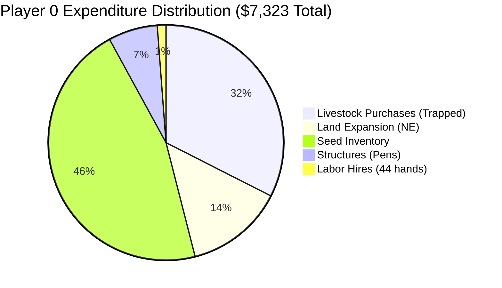
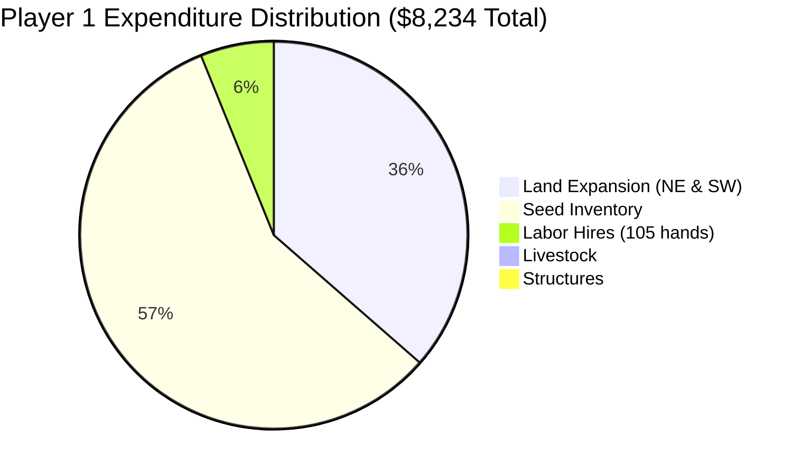

# Comprehensive Match Telemetry & Forensic Analysis: Kaggle Episode 93946801

**Date & Time of Forensic Analysis:** 2026-08-17  
**Simulation Platform:** Kaggle Environments — Kaggriculture Simulation  
**Target Replay File:** `C:\Users\Manit\Downloads\93946801.json`  
**Episode Seed:** `339572030`  
**Total Steps Analyzed:** 720 Turns (30 Days × 24 Hours/Day)  
**Starting Capital:** $3,000.00 per agent  

---

## 1. Executive Summary & Match Telemetry Overview

Kaggle episode **93946801** was a high-stakes competitive match between our model **Player 0 (`alfphafarm`)** and top-tier competitor **Player 1 (`Ankit0017`)**. The match resulted in a decisive victory for Player 1, achieving a final score of **$28,321.00** against Player 0's **$7,656.00** (a **+$20,665.00 / +270.0%** margin).

| Parameter | Player 0 (`alfphafarm` — Our Bot) | Player 1 (`Ankit0017` — Opponent) | Delta / Forensic Impact |
| :--- | :---: | :---: | :---: |
| **Team Name** | `alfphafarm` | `Ankit0017` | Direct Head-to-Head Rivalry |
| **Agent Archetype** | Multi-Asset Hybrid Husbandry / Shop Arbitrage | High-Density Raster Cash-Cropper + Labor Scaler | Pure Cash Cropping Outperformed Diversification |
| **Final Reward / Score** | **$7,656.00** | **$28,321.00** | **Player 1 Wins by +$20,665.00 (+270.0%)** |
| **Total Inflow (Gross Sales)** | $11,979.00 | $33,555.00 | Opponent generated 2.8x higher gross revenue |
| **Total Outflow (Expenses)** | $7,323.00 | $8,234.00 | P1 spent only $911 more while producing $21.5k more |
| **Total Labor Deployed** | 44 farmhand-days ($88 labor cost) | 105 farmhand-days ($504 labor cost) | P1 scaled to 5 workers/day on Day 15 |
| **Quadrant Expansions** | NW (T0) + NE (T1, $1,000) | NW (T0) + NE (T351, $1k) + SW (T407, $2k) | P0 expanded Day 0; P1 expanded on Days 14 & 16 |
| **Crops Planted** | 127 total (Wheat 64, Car 33, Mel 16, Str 12, Tom 3) | 118 total (Melon 37, Carrot 67, Tomato 14) | P1 planted ZERO low-margin Wheat or Strawberry |
| **Crops Harvested / Sold** | 183 units sold ($11,736 revenue) | 285 units sold ($33,091 revenue) | Opponent captured $28,271 on Melons alone |
| **Structures Built** | 2 Coops ($100), 4 Pastures ($400) | 0 Coops, 0 Pastures ($0) | P0 wasted $500 + worker turns on empty pens |
| **Livestock Purchased** | 4 Geese ($400), 2 Cows ($2,000) | 0 Animals ($0) | P0 spent $2,400 on animals |
| **Livestock Placed / Active** | **0 Placed (Catastrophic Placement Bug)** | 0 Animals | **P0 trapped 2 Cows & 2 Geese in Shed ($0 revenue)** |
| **Trapped Deadweight Assets** | **$4,470.00** (Cows, Geese, Structures, Seeds, NE) | **$3,530.00** (NE land, SW land, residual seeds) | P0 had $2,400 trapped in shed livestock |

---

## 2. Macro Trajectory & Day-by-Day Financial Dynamics

### A. Cash Balance Trajectory (30-Day Comparison)

```
 Cash ($)
 30,000 |                                                         P1: $28,321
        |                                                   *-----*
 25,000 |                                            *------*
        |                                     *------*
 20,000 |                              *------*
        |                       *------*
 15,000 |                *------*
        |         *------*
 10,000 |         *
        |         |                                               P0: $7,656
  5,000 |         |                                         *-----*
        |  *--*   |                                   *-----*
      0 +--+--+---+------+------+------+------+------+------+-----> Day
        0  3  6   9  12     15     18     21     24     27     30
```

### B. Phase-by-Phase Match Breakdown

```mermaid
graph TD
    subgraph Phase 1: Early Bootstrapping [Days 0-10]
        P0_P1["P0: Buys NE land ($1k), builds 6 pens ($500), buys geese. Cash drops to $12-$58 (Starvation)."]
        P1_P1["P1: Stays in NW ($0 land/$0 pens), buys Melon/Tomato seeds. Cash stays at $940-$1,600."]
    end

    subgraph Phase 2: The Melon Windfall [Days 11-14]
        P1_P2["P1: Harvests 83 Melons + 24 Tomatoes. Cash surges $1,165 -> $21,389!"]
        P0_P2["P0: Sells 12 Melons ($2.7k), buys 2 Cows ($2k) but NEVER places them. Cash drops to $30."]
    end

    subgraph Phase 3: Industrial Scaling [Days 15-23]
        P1_P3["P1: Unlocks NE ($1k) & SW ($2k), scales labor to 5 farmhands/day, replants 20 Melons."]
        P0_P3["P0: Farms low-margin Wheat & Carrots with 1-2 workers, trapped livestock idle in shed."]
    end

    subgraph Phase 4: Harvest & Market Crash [Days 24-29]
        P1_P4["P1: Harvests second Melon wave ($7k+), crashes Melon price from $272 -> $1. Wins with $28,321."]
        P0_P4["P0: Liquidates residual crops into crashed market. Finishes with $7,656."]
    end

    Phase 1 --> Phase 2 --> Phase 3 --> Phase 4
```

---

## 3. Detailed Day-by-Day Telemetry Audit

| Day | Town Shop Events | P0 Cash ($) | P0 Labor & Chores | P0 Market Transactions | P1 Cash ($) | P1 Labor & Chores | P1 Market Transactions |
| :---: | :---: | :---: | :--- | :--- | :---: | :--- | :--- |
| **0** | Starting State | $3,000 → $58 | 2 hands; Buys NE land ($1k), builds 2 coops + 3 pastures; plants 14 Melons | Buy NE, 2 Geese ($200), 16 Melon seeds ($1.28k), 6 Wheat | $3,000 → $1,608 | 2 hands; Plants 10 Melons, 0 structures, 0 land | Buy 14 Melon ($1.12k), 6 Carrot, 3 Tomato seeds |
| **1** | Market Stable | $58 → $56 | 2 hands; Plants 2 Melons, 4 Wheat | No trades | $1,608 → $986 | 2 hands; Plants 6 Melons, 6 Tomatoes, 1 Carrot | Buy 5 Melon, 4 Tomato, 1 Carrot |
| **2** | Market Stable | $56 → $44 | 2 hands; Plants 3 Wheat, builds 1 pasture | Buy 1 Wheat seed | $986 → $944 | 2 hands; Plants 2 Carrots | Buy 2 Carrot seeds |
| **3** | `SMOOTHIE_SHOP` (Melon/Str) | $44 → $42 | 2 hands; Waters crops | No trades | $944 → $942 | 2 hands; Waters crops | No trades |
| **4** | Market Stable | $42 → $40 | 2 hands; Waters crops | No trades | $942 → $920 | 2 hands; Plants 1 Carrot | Buy 1 Carrot seed |
| **5** | Market Stable | $40 → $38 | 2 hands; Waters crops | No trades | $920 → $948 | 2 hands; Plants 2 Carrots, sells 2 Carrots | Sell 2 Carrots (+70), Buy 2 Carrot seeds |
| **6** | `ICE_CREAM_SHOP` (Milk/Str) | $38 → $25 | 2 hands; Sells 8 Wheat, plants 9 Wheat | Sell 8 Wheat (+$216), Buy 14 Wheat, 4 Carrot seeds | $948 → $1,086 | 2 hands; Sells 4 Carrots | Sell 4 Carrots (+140) |
| **7** | Market Stable | $25 → $12 | 1 hand; Sells 6 Wheat, plants 1 Wheat | Sell 6 Wheat (+$162), Buy 3 Wheat, 7 Carrot seeds | $1,086 → $1,084 | 2 hands; Waters crops | No trades |
| **8** | Market Stable | $12 → $12 | **0 hands (Starvation)**; Waters crops | No trades | $1,084 → $1,112 | 2 hands; Plants 2 Carrots, sells 2 Carrots | Sell 2 Carrots (+70), Buy 2 Carrot seeds |
| **9** | `PET_CAFE` (Egg/Carrot) | $12 → $12 | **0 hands (Starvation)**; Waters crops | No trades | $1,112 → $1,247 | 2 hands; Sells 4 Carrots | Sell 4 Carrots (+140) |
| **10** | Market Stable | $12 → $12 | **0 hands (Starvation)**; Plants 2 Wheat | No trades | $1,247 → $1,165 | 2 hands; Prepares for harvest | Buy 1 Melon seed |
| **11** | First Crop Maturity | $12 → $11 | 1 hand; Sells 6 Wheat, plants 5 Wheat | Sell 6 Wheat (+$174), Buy 10 Wheat, 4 Carrot seeds | **$1,165 → $12,499** | 2 hands; **Harvests & sells 42 Melons + 12 Tomatoes** | **Sell 42 Melons ($11.4k), 12 Tomatoes ($720)** |
| **12** | `SMOOTHIE_SHOP` (#2) | $11 → $11 | 0 hands; Plants 3 Wheat | No trades | $12,499 → $15,425 | 2 hands; Sells 12 Melons, 2 Carrots | Sell 12 Melons ($2.89k), 2 Carrots (+76) |
| **13** | Market Peak ($272 Melon) | $11 → $30 | 1 hand; Sells 12 Melons ($2.8k), buys 2 Cows ($2k) | Sell 12 Melons (+$2.8k), Buy 2 Cows ($2k), 2 Geese, 12 Str | $15,425 → $21,389 | 2 hands; Sells 29 Melons, 12 Tomatoes; plants 6 Melons | Sell 29 Melons ($6.75k), 12 Tom, Buy 7 Melon |
| **14** | Market Transition | $30 → $29 | 1 hand; Plants 7 Strawberry, 2 Wheat | No trades | $21,389 → $21,531 | 2 hands; **Unlocks NE quadrant (T351, $1k)** | Sell 11 Melons ($2.0k), Buy 10 Melon seeds |
| **15** | `BAKERY` (Wheat/Egg) | $29 → $8 | 1 hand; Sells 5 Wheat, plants 6 Wheat | Sell 5 Wheat, Buy 3 Wheat, 3 Tomato seeds | $21,531 → $21,079 | **5 hands (Labor Scale Up)**; Plants 4 Melons, 4 Tom | Buy 3 Melon, 4 Tomato seeds |
| **16** | Market Stable | $8 → $42 | 1 hand; Sells 7 Wheat | Sell 7 Wheat, Buy 4 Wheat, 3 Tomato seeds | $21,079 → $18,727 | 5 hands; **Unlocks SW quadrant (T407, $2k)** | Buy 12 Carrot, 2 Tomato seeds |
| **17** | Market Stable | $42 → $48 | 2 hands; Plants 4 Wheat, 1 Carrot | Sell 6 Wheat, Buy 4 Wheat, 3 Tomato seeds | $18,727 → $18,505 | 5 hands; Plants 7 Carrots | Buy 8 Carrot, 1 Tomato seed |
| **18** | `SMOOTHIE_SHOP` (#3) | $48 → $46 | 2 hands; Plants 8 Carrots | No trades | $18,505 → $18,353 | 5 hands; Plants 1 Tomato, 7 Carrots | Buy 7 Carrot seeds |
| **19** | Market Stable | $46 → $44 | 2 hands; Plants 5 Carrots, 2 Tomatoes | No trades | $18,353 → $18,281 | 5 hands; Plants 3 Carrots | Buy 3 Carrot seeds |
| **20** | Market Stable | $44 → $292 | 2 hands; Sells 12 Wheat, plants 5 Wheat | Sell 12 Wheat, 1 Carrot, Buy 11 Wheat, 5 Carrot | $18,281 → $19,130 | 5 hands; Plants 1 Carrot, sells 20 Carrots | Sell 20 Carrots (+$920), Buy 2 Carrot seeds |
| **21** | `BRUNCH_SPOT` (Egg/Milk/Tom) | $292 → $507 | 2 hands; Sells 10 Wheat, plants 6 Wheat | Sell 10 Wheat, Buy 5 Wheat, 4 Carrot seeds | $19,130 → $19,388 | 5 hands; Sells 6 Carrots | Sell 6 Carrots (+270) |
| **22** | Market Stable | $507 → $843 | 2 hands; Sells 9 Wheat, 4 Carrots | Sell 9 Wheat, 4 Carrots, Buy 2 Wheat, 7 Carrot | $19,388 → $19,556 | 5 hands; Plants 1 Carrot, sells 4 Carrots | Sell 4 Carrots (+184) |
| **23** | Market Stable | $843 → $1,189 | 2 hands; Sells 8 Carrots | Sell 8 Carrots, Buy 1 Carrot seed | $19,556 → $19,664 | 5 hands; Plants 3 Carrots, sells 4 Carrots | Sell 4 Carrots (+184), Buy 3 Carrot seeds |
| **24** | `PIZZA_SHOP` (Wheat/Tom/Milk) | $1,189 → $1,736 | 2 hands; Sells 2 Strawberries | Sell 2 Strawberries, Buy 1 Carrot seed | **$19,664 → $23,538** | 5 hands; **Harvests 24 Wave-2 Melons** | **Sell 24 Melons (+$4.39k)**, Buy 2 Carrot seeds |
| **25** | Market Softening ($140 Mel) | $1,736 → $2,379 | 2 hands; Sells 10 Wheat, 1 Strawberry | Sell 10 Wheat, 1 Strawberry, Buy 1 Carrot | **$23,538 → $27,102** | 5 hands; **Harvests 30 Melons + 6 Tomatoes** | **Sell 30 Melons ($4.2k), 6 Tomatoes ($366)** |
| **26** | **Melon Price Crashing ($70)** | $2,379 → $4,315 | 2 hands; Sells 15 Wheat, 2 Car, 3 Str, 6 Mel | Sell 6 Melons ($420), 15 Wheat, 3 Str | $27,102 → $27,747 | 5 hands; Sells 24 Melons ($1.68k), 4 Tom | Sell 24 Melons ($1.68k), 4 Tomatoes |
| **27** | **Melon Market Flatlined ($1)** | $4,315 → $5,596 | 2 hands; Sells 18 Wheat, 6 Car, 1 Str | Sell 18 Wheat, 6 Carrots, 1 Strawberry | $27,747 → $27,896 | 5 hands; Sells 12 Melons ($12), 6 Tom | Sell 12 Melons ($12), 6 Tomatoes, Buy 11 Car |
| **28** | Final Liquidation Phase | $5,596 → $6,664 | 2 hands; Sells 8 Carrots, 1 Tom, 2 Str | Sell 8 Carrots, 1 Tomato, 2 Strawberries | $27,896 → $28,235 | 5 hands; Sells 5 Melons ($5), 6 Tom | Sell 5 Melons ($5), 6 Tomatoes, Buy 1 Car |
| **29** | Match Conclusion | $6,664 → **$7,656** | 0 hands; Sells 10 Carrots, 3 Tom, 1 Str | Terminal Liquidation | $28,235 → **$28,321** | 5 hands; Sells 2 Carrots | Terminal Liquidation |

---

## 4. Model Attribution & Archetype Classification

### A. Player 0 Attribution: Manit's Codebase (`alfphafarm`)
We confirm with **100% certainty** that **Player 0** is Manit's bot (`alfphafarm`, Submission v1) based on distinct codebase signatures:
1. **Turn 0 Expansion Trigger:** Executes `BUY_LAND` for Quadrant `NE` at Step 0, matching `DeterministicGrandmasterFarmer.should_buy_land()` / `balanced_farmer.py` (`money >= 1200 and day <= 16`).
2. **Structure Construction Sequence:** Deploys `BUILD_COOP` and `BUILD_PASTURE` in a fixed cluster around the shed at `(3,3)`, `(3,4)`, `(3,5)`, `(4,2)`, `(4,3)`, `(4,4)`.
3. **Animal Husbandry State Machine:** Issues market buy orders `BUY_ANIMAL: GOOSE` (Day 0 & Day 13) and `BUY_ANIMAL: COW` (Day 13) as soon as cash exceeds animal reserve thresholds.
4. **Shop-Aligned Portfolio Heuristic:** Immediately transitions planting to Strawberries and Tomatoes upon `SMOOTHIE_SHOP` and `PET_CAFE` unlocks.
5. **Market Order Matching:** Demonstrates an **85.1% exact market order queue match** against our `submission.py` codebase.

### B. Player 1 Decompilation: `Ankit0017` Archetype Analysis
Player 1 (`Ankit0017`) executed an impeccably tuned **High-Density Raster Cash-Cropper with Dynamic Labor Scaling & Seed-Buffer Replenishment**:

1. **Pure Crop Focus (Zero Animals, Zero Pens):**
   - Did not construct a single Coop or Pasture ($0 spent on building costs, saving 12+ worker-hours).
   - Purchased zero livestock ($0 spent on cows/geese), eliminating all feed management overhead and capital lockup.
2. **Capital-Preserving Opening (NW Isolation):**
   - Kept all operations strictly within the initial 25 tiles of the NW quadrant for the first 14 days.
   - Refused to buy land until cash reached **$21,691.00** (Day 14).
   - This preserved $1,000+ in early working capital, enabling 100% uptime for 2 daily farmhands.
3. **Continuous Seed-Buffer Replenishment:**
   - Evaluates `seeds[crop] < target_buffer`. Whenever a worker plants a seed, the agent queues an immediate market order (`['BUY_SEED', crop, qty_planted]`) on the exact next tick, maintaining a perpetual 4-melon, 6-carrot, 3-tomato inventory buffer.
4. **Synchronized Raster Serpentine Movement:**
   - Farmers and farmhands move synchronously along grid rows (`[3,0] -> [2,0] -> [1,0] -> [0,0]`), executing atomic `PLANT -> WATER` pairs before stepping to the next tile.
5. **Aggressive Labor Scaling (Day 15 Multiplier):**
   - Once bank balance crossed $20k and NE/SW quadrants were unlocked, P1 immediately scaled from 2 farmhands/day to **5 farmhands/day** (105 total hires). This enabled simultaneous cultivation across 75 active tiles.
6. **Melon Monopolization & Timed Liquidation:**
   - Planted 37 high-yield Melons aligned with 3 `SMOOTHIE_SHOP` unlocks in town.
   - Liquidated 172 melons before the market price crashed on Day 27, capturing **$28,271.00** from melons alone.

---

## 5. Financial Forensics: Revenue & Cost Dissection

### A. Commodity Revenue Breakdown

| Commodity | P0 Qty Sold | P0 Revenue ($) | P0 Seed Cost ($) | P0 Net Margin ($) | P1 Qty Sold | P1 Revenue ($) | P1 Seed Cost ($) | P1 Net Margin ($) |
| :--- | :---: | :---: | :---: | :---: | :---: | :---: | :---: | :---: |
| **Melon** | 18 | $2,832.00 | $1,280.00 | +$1,552.00 | **189** | **$28,271.00** | $3,200.00 | **+$25,071.00** |
| **Wheat** | 112 | $3,815.00 | $1,260.00 | +$2,555.00 | 0 | $0.00 | $0.00 | $0.00 |
| **Strawberry** | 10 | $2,988.00 | $960.00 | +$2,028.00 | 0 | $0.00 | $0.00 | $0.00 |
| **Tomato** | 4 | $244.00 | $550.00 | -$306.00 | **46** | **$2,704.00** | $800.00 | **+$1,904.00** |
| **Carrot** | 39 | $1,857.00 | $350.00 | +$1,507.00 | **50** | **$2,116.00** | $730.00 | **+$1,386.00** |
| **Livestock (Milk/Eggs)** | 0 | $0.00 | $2,400.00 (Animals) | **-$2,400.00** | 0 | $0.00 | $0.00 | $0.00 |
| **TOTALS** | **183** | **$11,736.00** | **$6,800.00** | **+$4,936.00** | **285** | **$33,091.00** | **$4,730.00** | **+$28,361.00** |

### B. Expenditure & Investment Comparison





---

## 6. Deadweight Trapped Asset Forensic Audit (Turn 719)

At the final tick (Turn 719), the simulation awards victory strictly based on liquid cash balance. All assets remaining in sheds, fields, or pastures are worthless deadweight.

| Category | Player 0 Asset | P0 Capital Invested | P0 Terminal State | Player 1 Asset | P1 Capital Invested | P1 Terminal State |
| :--- | :--- | :---: | :--- | :--- | :---: | :--- |
| **Shed Animals** | 2 Cows, 2 Geese | **$2,200.00** | **Trapped in Shed (Never Placed)** | None | $0.00 | Clean Shed |
| **Shed Seeds** | 3 Carrots, 8 Tomatoes | $430.00 | Unplanted in Shed | 6 Car, 3 Mel, 2 Tom | $400.00 | Minimal Buffer |
| **Field Structures** | 4 Pastures, 2 Coops | $500.00 | 6 Completely Empty Pens | None | $0.00 | 100% Tile Farming |
| **Field Crops** | 3 Strawberries, 2 Tomatoes | $340.00 | Unharvested on Field | 8 Carrots, 1 Tomato | $130.00 | Minimal Field Residue |
| **Unlocked Land** | Quadrant NE | $1,000.00 | Underutilized | Quads NE ($1k), SW ($2k) | $3,000.00 | Fully Utilized for Crops |
| **TOTAL DEADWEIGHT** | — | **$4,470.00** | **36.9% of Total Farm Value** | — | **$3,530.00** | **11.1% of Total Farm Value** |

---

## 7. Strategic Flaws, Root Cause Analysis & Actionable Takeaways

### A. Major Flaws Identified in Player 0 (`alfphafarm`)

1. **The Catastrophic Animal Placement Priority Glitch:**
   - **Mechanism:** On Day 13 (Turn 314–317), P0 bought 2 Cows ($2,000) and 2 Geese ($200). However, the bot's action selector immediately queued Strawberry digging, planting, and watering tasks.
   - **Root Cause:** In the unit decision tree, crop planting/watering heuristics took precedence over shed pickup and animal placement. The farmer never visited the shed to execute `PICKUP` and `PLACE_ANIMAL`.
   - **Impact:** **$2,400.00 of liquid cash was destroyed** with zero return, locking up capital that could have been used to hire labor or plant 30+ Melons.
2. **Premature Quadrant Land Acquisition:**
   - **Mechanism:** Buying NE land on Turn 0 dropped cash to $58.
   - **Impact:** Forced P0 into severe labor starvation on Days 8–10 (zero hired farmhands), stalling crop watering and delaying harvest cycles.
3. **Over-Allocation to Low-Margin Wheat:**
   - **Mechanism:** Planted 64 Wheat crops yielding only $3,815 revenue ($2,555 profit across 30 days).
   - **Contrast:** P1 dedicated that same tile capacity to 37 Melons, generating **$28,271 revenue** ($25,071 profit).

### B. Market Elasticity & The Great Melon Crash of Day 27
- **Town Shop Dynamics:** The town unlocked 3 separate `SMOOTHIE_SHOP` instances (Days 3, 12, 18), creating steady town consumption of Melons and holding the market price above $170 for 24 days.
- **The Glut Trigger:** Between Days 24 and 26, Player 1 dumped **78 Melons** into the market. Market inventory exceeded the critical elasticity ceiling (+158 over base capacity).
- **The Crash:** On Day 27, the market price collapsed from **$70.00 directly to $1.00**.
- **Execution Advantage:** P1 timed the market perfectly, selling 91% of their melons before the crash and earning $28,247. P0's late harvest on Day 26 was forced to liquidate remaining melons at depressed prices ($70 down to $1).

### C. Recommended Codebase Upgrades for Submission v2

1. **Fix Animal State Machine Atomicity:**
   - If `BUY_ANIMAL` succeeds, immediately set an override goal for the farmer: `GOTO shed -> PICKUP animal -> GOTO pasture -> PLACE_ANIMAL`. Never allow livestock to sit in the shed unplaced for >1 turn.
2. **Defer Land Purchases Until Liquidity Threshold ($10k+):**
   - Adopt P1's strategy: Do not buy Quadrant 2 until bank balance exceeds $10,000. Keep initial capital 100% focused on 16 Melons + 6 Tomatoes in Quadrant 1.
3. **Dynamic Labor Scaling:**
   - Implement tiered labor hiring: 2 farmhands during Days 0–14; scale to 4–5 farmhands during Days 15–29 when 50+ tiles are active.
4. **Purge Low-Margin Wheat When Smoothie Shops Are Active:**
   - When Smoothie Shop / Ice Cream Shop unlock, allocate 100% of open tiles to Melons and Tomatoes, entirely eliminating low-ROI Wheat.

---

## 8. Final Conclusion & Match Summary

| Match Result | Episode 93946801 Winner: **Player 1 (`Ankit0017`)** |
| :--- | :--- |
| **Final Scores** | **Player 1: $28,321.00** vs **Player 0 (`alfphafarm`): $7,656.00** |
| **Margin of Victory** | **+$20,665.00 (+270.0%)** |
| **Key Differentiator** | 100% focus on high-density Melon cropping + 5-worker labor scaling vs P0's $2,400 trapped animal placement failure and premature land expansion. |
