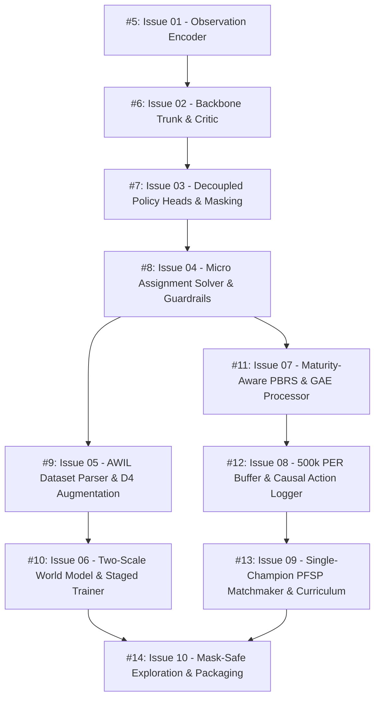

# Map: Kaggriculture Champion Bot End-to-End Pipeline

**Master Spec**: [GitHub Issue #4](https://github.com/Vudattumaniteja/kaggriculture-champion-bot/issues/4) | [.scratch/kaggriculture-champion-pipeline/spec.md](file:///C:/Users/Manit/Desktop/kaggle/.scratch/kaggriculture-champion-pipeline/spec.md)  
**Domain Context**: [CONTEXT.md](file:///C:/Users/Manit/Desktop/kaggle/CONTEXT.md)  
**Status**: In Progress  

---

## Dependency Graph & Frontier

---

## Tickets Breakdown

| Ticket | GitHub Issue | Title | Blocked by | Status |
| :--- | :--- | :--- | :--- | :--- |
| **01** | [#5](https://github.com/Vudattumaniteja/kaggriculture-champion-bot/issues/5) | 24-Channel Spatial & 72-Dim Scalar Observation Encoder with Invariant Geometric Fields | None | `ready-for-agent` (Frontier) |
| **02** | [#6](https://github.com/Vudattumaniteja/kaggriculture-champion-bot/issues/6) | FiLM-Modulated SE-ResNet Backbone Trunk & 1001-Bin Symlog Value Critic | #5 | `ready-for-agent` |
| **03** | [#7](https://github.com/Vudattumaniteja/kaggriculture-champion-bot/issues/7) | Decoupled Multi-Head Policy with Pre-Softmax Analytical Action Masking | #6 | `ready-for-agent` |
| **04** | [#8](https://github.com/Vudattumaniteja/kaggriculture-champion-bot/issues/8) | Two-Stage Market Guardrails & Neural-Weighted Hungarian Micro Assignment Solver | #7 | `ready-for-agent` |
| **05** | [#9](https://github.com/Vudattumaniteja/kaggriculture-champion-bot/issues/9) | Grandmaster Replay Dataset Parser with D4 Coordinate Augmentation & AWIL Scorer | #8 | `ready-for-agent` |
| **06** | [#10](https://github.com/Vudattumaniteja/kaggriculture-champion-bot/issues/10) | Two-Scale Hierarchical World Model & Two-Group Staged AWIL Trainer | #9 | `ready-for-agent` |
| **07** | [#11](https://github.com/Vudattumaniteja/kaggriculture-champion-bot/issues/11) | Maturity-Aware Potential-Based Reward Shaping (PBRS) & Trajectory GAE Processor | #8 | `ready-for-agent` |
| **08** | [#12](https://github.com/Vudattumaniteja/kaggriculture-champion-bot/issues/12) | 500k Verified Prioritized Experience Replay (PER) & Causal Action Logger | #11 | `ready-for-agent` |
| **09** | [#13](https://github.com/Vudattumaniteja/kaggriculture-champion-bot/issues/13) | Prioritized Fictitious Self-Play (PFSP) Single-Champion Matchmaker & Heuristic Warmup Curriculum | #12 | `ready-for-agent` |
| **10** | [#14](https://github.com/Vudattumaniteja/kaggriculture-champion-bot/issues/14) | Mask-Safe Dirichlet Exploration, Cosine Entropy Decay & Standalone Submission Packaging | #10, #13 | `ready-for-agent` |
