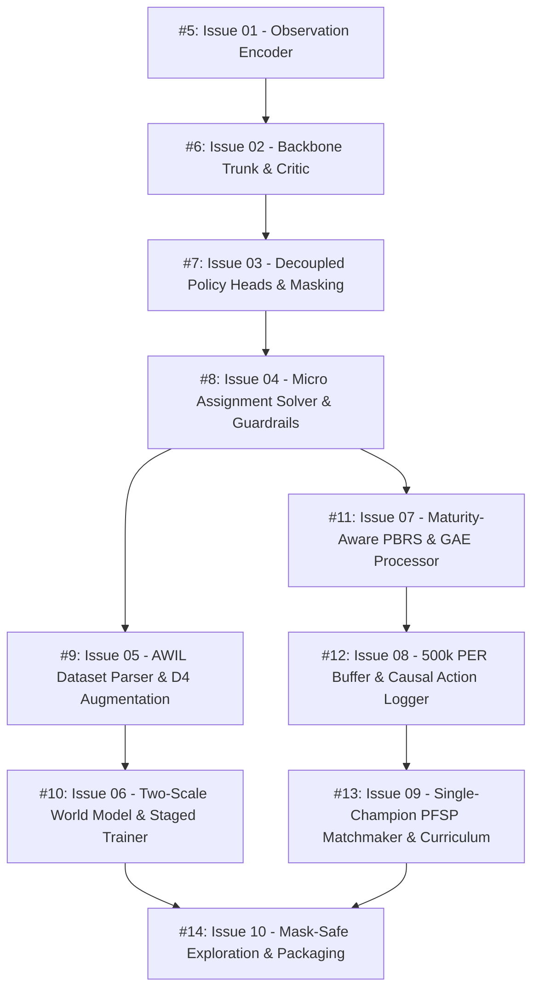

# Map: Kaggriculture Champion Bot End-to-End Pipeline

**Master Spec**: [GitHub Issue #4](https://github.com/Vudattumaniteja/kaggriculture-champion-bot/issues/4) | [.scratch/kaggriculture-champion-pipeline/spec.md](file:///C:/Users/Manit/Desktop/kaggle/.scratch/kaggriculture-champion-pipeline/spec.md)  
**Domain Context**: [CONTEXT.md](file:///C:/Users/Manit/Desktop/kaggle/CONTEXT.md)  
**Target Workspace**: `grilling model/` (`C:\Users\Manit\Desktop\kaggle\grilling model\`)  
**Status**: In Progress  

---

## Workspace Isolation Requirement
All code, models, SSL/AWIL pre-training, RL self-play, replay parsers, datasets, tests, and submission files must strictly reside in `grilling model/`:
```
grilling model/
├── src/
│   ├── encoder.py              # Issue 01 (#5)
│   ├── network.py              # Issue 02 (#6), Issue 03 (#7)
│   ├── micro_solver.py         # Issue 04 (#8)
│   ├── agent.py                # Issue 04 (#8)
│   ├── awil_dataset.py         # Issue 05 (#9)
│   ├── world_model.py          # Issue 06 (#10)
│   ├── trainer.py              # Issue 06 (#10)
│   ├── pbrs_gae.py             # Issue 07 (#11)
│   ├── replay_buffer.py        # Issue 08 (#12)
│   ├── league.py               # Issue 09 (#13)
│   ├── curriculum.py           # Issue 09 (#13)
│   └── build_submission.py    # Issue 10 (#14)
├── tests/                      # Unit and integration test suites
├── data/                       # Replays and processed datasets
├── weights/                    # Neural checkpoints and FP16 weights
└── submission.py               # Final self-contained tournament submission bot
```

---

## Dependency Graph & Frontier



---

## Tickets Breakdown

| Ticket | GitHub Issue | Title | Target Path | Blocked by | Status |
| :--- | :--- | :--- | :--- | :--- | :--- |
| **01** | [#5](https://github.com/Vudattumaniteja/kaggriculture-champion-bot/issues/5) | 24-Channel Spatial & 72-Dim Scalar Observation Encoder | `grilling model/src/encoder.py` | None | `ready-for-agent` (Frontier) |
| **02** | [#6](https://github.com/Vudattumaniteja/kaggriculture-champion-bot/issues/6) | FiLM-Modulated SE-ResNet Backbone Trunk & 1001-Bin Symlog Value Critic | `grilling model/src/network.py` | #5 | `ready-for-agent` |
| **03** | [#7](https://github.com/Vudattumaniteja/kaggriculture-champion-bot/issues/7) | Decoupled Multi-Head Policy with Pre-Softmax Analytical Action Masking | `grilling model/src/network.py` | #6 | `ready-for-agent` |
| **04** | [#8](https://github.com/Vudattumaniteja/kaggriculture-champion-bot/issues/8) | Two-Stage Market Guardrails & Hungarian Micro Assignment Solver | `grilling model/src/micro_solver.py` | #7 | `ready-for-agent` |
| **05** | [#9](https://github.com/Vudattumaniteja/kaggriculture-champion-bot/issues/9) | Grandmaster Replay Dataset Parser with D4 Coordinate Augmentation & AWIL Scorer | `grilling model/src/awil_dataset.py` | #8 | `ready-for-agent` |
| **06** | [#10](https://github.com/Vudattumaniteja/kaggriculture-champion-bot/issues/10) | Two-Scale Hierarchical World Model & Two-Group Staged AWIL Trainer | `grilling model/src/world_model.py` | #9 | `ready-for-agent` |
| **07** | [#11](https://github.com/Vudattumaniteja/kaggriculture-champion-bot/issues/11) | Maturity-Aware Potential-Based Reward Shaping (PBRS) & Trajectory GAE Processor | `grilling model/src/pbrs_gae.py` | #8 | `ready-for-agent` |
| **08** | [#12](https://github.com/Vudattumaniteja/kaggriculture-champion-bot/issues/12) | 500k Verified Prioritized Experience Replay (PER) & Causal Action Logger | `grilling model/src/replay_buffer.py` | #11 | `ready-for-agent` |
| **09** | [#13](https://github.com/Vudattumaniteja/kaggriculture-champion-bot/issues/13) | Prioritized Fictitious Self-Play (PFSP) Single-Champion Matchmaker & Heuristic Warmup Curriculum | `grilling model/src/league.py` | #12 | `ready-for-agent` |
| **10** | [#14](https://github.com/Vudattumaniteja/kaggriculture-champion-bot/issues/14) | Mask-Safe Dirichlet Exploration, Cosine Entropy Decay & Standalone Submission Packaging | `grilling model/submission.py` | #10, #13 | `ready-for-agent` |
