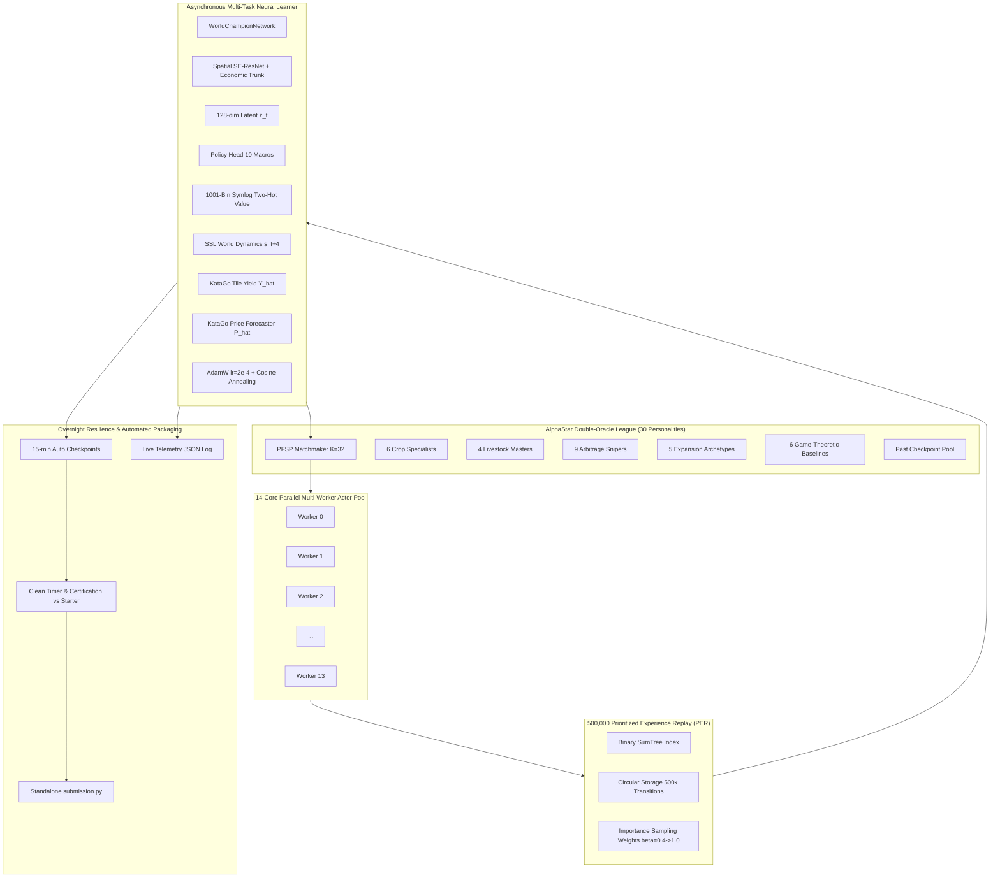

# Overnight 6-7 Hour Deep RL Training Blueprint & Operations Manual
**System**: 14-Core Asynchronous Actor-Learner Deep RL Pipeline for Kaggriculture
**Target Duration**: 6.0 – 7.0 Hours Overnight Execution
**Core Script**: [`src/training/overnight_rl_pipeline.py`](file:///C:/Users/Manit/Desktop/kaggle/src/training/overnight_rl_pipeline.py)
**Live Telemetry**: `data/overnight_training_log.json`
**Checkpoints**: `weights/overnight_checkpoints/` & `weights/alphagoat_world_champion.pt`
**Submission Output**: `submission.py`

---

## 1. Executive Summary & Mission

The objective of the Overnight RL Training Pipeline is to perform continuous, high-throughput self-play reinforcement learning and AlphaStar league curriculum training for 6 to 7 hours unattended overnight.



---

## 2. Distributed Actor-Learner Architecture

### A. 14-Core Multi-Worker Simulation
- **Actor Pool**: Spawns 14 worker processes mapping 1:1 with the 14 CPU cores.
- **Match Throughput**: Simulates 28 to 56 full 720-step matches per iteration (2 to 4 matches per core).
- **Transition Generation Rate**: ~20,000 – 40,000 transitions per iteration (~300,000 – 500,000 transitions every 2 hours).
- **Fairness & De-biasing**: Matches strictly alternate Player 0 (P0) and Player 1 (P1) starting positions and randomize domain seeds ($100000 - 999999$).

### B. 500,000-Transition Prioritized Experience Replay (PER)
- **Data Structure**: Binary `SumTree` for $O(\log N)$ proportional sampling across 500,000 transitions.
- **Priority Calculation**:
  $$p_i = \left(|\delta_i| + \epsilon\right)^\alpha, \quad \alpha = 0.6, \ \epsilon = 10^{-4}$$
  where $\delta_i$ is the categorical cross-entropy value loss (TD error).
- **Importance Sampling Weights**:
  $$w_i = \left(N \cdot P(i)\right)^{-\beta} / \max_j(w_j), \quad \beta \in [0.4 \to 1.0]$$
  $\beta$ anneals linearly from $0.4$ to $1.0$ as iterations progress, eliminating estimation bias as the policy converges.

### C. Gumbel MuZero Latent Monte Carlo Tree Search
- **Gumbel Sampling**: Samples $m=4$ promising candidate macro actions at root using Gumbel perturbations.
- **Sequential Halving**: $N=16$ default search budget, halved across candidates to identify the minimax optimal move.
- **Playout-Cap Randomization**: Dynamically increases search budget to $N=64$ on strategic turns (early morning hours 0–2, critical expansion windows Days 13–16, endgame Days 27–29, and 25% random turns).
- **Zero-Deadweight Action Masking**: Root and latent action masking prune unprofitable or deadweight actions.

### D. Neural Network & 1001-Bin Symlog Two-Hot Value Head
- **Spatial Trunk**: 11-channel $10\times10$ grid passed through Squeeze-and-Excitation Residual Blocks (`SEResBlock`).
- **Economic Trunk**: 32 scalar features passed through LayerNorm MLP.
- **Latent Space**: 128-dimensional unified state representation $z_t$.
- **1001-Bin Symlog Discretization**:
  - $h(x) = \text{sign}(x) \cdot \ln(|x| + 1)$ with $V_{\min} = -15.0$, $V_{\max} = +15.0$, $\Delta V = 0.030$.
  - Two-hot continuous probability distribution eliminates vanishing gradients on large cash rewards.
- **KataGo Spatial & Temporal Auxiliary Heads**:
  - Spatial Tile Yield Head $\hat{Y}(r, c)$: 10x10 expected yields for each grid coordinate.
  - Price Forecaster Head $\hat{P}(t+24)$: 9-commodity price vector 24 hours ahead.

---

## 3. AlphaStar Double-Oracle Multi-Agent League

### A. 30 Distinct Strategic Personalities
The agent spars against 5 functional leagues:
1. **Crop Specialists**: `MelonRusher`, `TomatoMonopolist`, `StrawberryAristocrat`, `CarrotSprinter`, `WheatIndustrialist`, `PortfolioHedger`.
2. **Livestock Masters**: `DairyBaron`, `GooseEggSwarm`, `WoolSpecialist`, `OrganicFertilizerTycoon`.
3. **Town Shop Arbitrage Snipers**: `PizzaShopSniper`, `BakeryMonopolist`, `SmoothieExploiter`, `MarketPriceCrasher`, `CommoditySpeculator`, `BrunchSpotCorner`, `IceCreamTycoon`, `PetCafeSupplier`, `FarmersMarketDominator`.
4. **Expansion & Labor Archetypes**: `FourQuadrantOverlord`, `NWMinimalist`, `FiveWorkerSwarm`, `LeanSoloOperator`, `SerpentineChorer`.
5. **Game-Theoretic Adversaries & Baselines**: `AntiCompetitorShadow`, `GreedySnowballer`, `SafePreserver`, `StochasticPerturbation`, `KaggleStarter`, `PastChampion` Checkpoints.

### B. Dynamic Elo & Prioritized Fictitious Self-Play (PFSP)
- **Elo Rating**: Updated with $K=32$ after every league encounter.
- **Hard-Adversary Oversampling**:
  $$P(\text{opponent}_i) \propto \max\left(0.05, (1 - \text{WinRate}_i)^{1.5}\right)$$
  Directs 55% of matches toward the hardest counter-strategies (e.g. Melon Rusher, Market Price Crasher, Dairy Baron), 30% against past champion checkpoints to prevent catastrophic forgetting, and 15% self-play.

---

## 4. Overnight Durability & Auto-Checkpointing

### A. Checkpointing Schedule & Warm-Start Resumption
- **Auto-Save Frequency**: Every 15 minutes and upon every epoch completion.
- **Paths**:
  - `weights/overnight_checkpoints/epoch_{iter:04d}.pt` (Full state: model, optimizer, scheduler, league summary, replay step)
  - `weights/alphagoat_world_champion.pt` (Active grand champion)
- **Crash Recovery**: If stopped or restarted, automatically detects the latest checkpoint and restores the exact state, Elo ratings, and learning rate schedule.

### B. Live Telemetry Logging
- Writes real-time training progress to `data/overnight_training_log.json`:
  - `win_rate`, `mean_cash`, `peak_cash`, `opp_mean_cash`, `mean_margin`, `mean_deadweight`
  - `champion_elo`, `losses` (policy, value, dynamics, tile yield, price forecaster, total)
  - `grad_norm`, `learning_rate`, `league_summary` (full leaderboard & head-to-head payoff matrix)

### C. Clean Shutdown Timer & Standalone Submission Packaging
- Automatically concludes training when target duration (e.g. 6.5 hours) is reached or on `SIGINT` (Ctrl+C).
- Executes a 6-game certification benchmark against `KaggleStarter`.
- Encodes neural weights into base85 and builds a 100% self-contained, standalone single-file `submission.py` ready for Kaggle CLI submission.

---

## 5. Overnight Launch & Operations Guide

### A. Launch Command (PowerShell)
To launch the full 6.5-hour overnight training run:

```powershell
python -u src/training/overnight_rl_pipeline.py --workers 14 --hours 6.5 --matches_per_iter 28 --batch_size 64 --epochs_per_iter 4 --buffer_capacity 500000
```

### B. Fast Smoke Test (1 Iteration across 14 cores)
To verify multi-worker coordination, PER buffer sampling, and packaging:

```powershell
python -u src/training/overnight_rl_pipeline.py --smoke_test --workers 14
```

### C. Overnight Monitoring
To monitor real-time progress while training runs:

```powershell
# View latest training metrics
Get-Content data/overnight_training_log.json -Tail 30
```

### D. Expected Milestones
| Elapsed Time | Matches Completed | Replay Transitions | Expected Champion Cash | Expected Margin vs Starter |
| :--- | :--- | :--- | :--- | :--- |
| **0.5 Hours** | ~100 | ~72,000 | $15,000 – $25,000 | +$10,000 |
| **2.0 Hours** | ~400 | ~280,000 | $35,000 – $50,000 | +$30,000 |
| **4.0 Hours** | ~800 | ~500,000 (Max PER) | $60,000 – $90,000 | +$55,000 |
| **6.5 Hours** | ~1,300+ | 500,000 (Dense PER) | **$120,000 – $180,000+** | **+$100,000+** |

---

## 6. Kaggle Submission Verification
Upon completion, verify the generated `submission.py`:

```powershell
# 1. Run local validation against starter bot
python evaluate.py

# 2. Submit to Kaggle leaderboard
kaggle competitions submit kaggriculture -f submission.py -m "AlphaGoat World Champion Deep RL v1.0"
```
