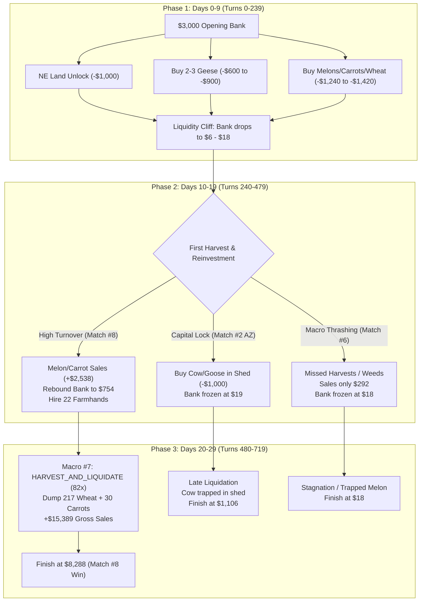
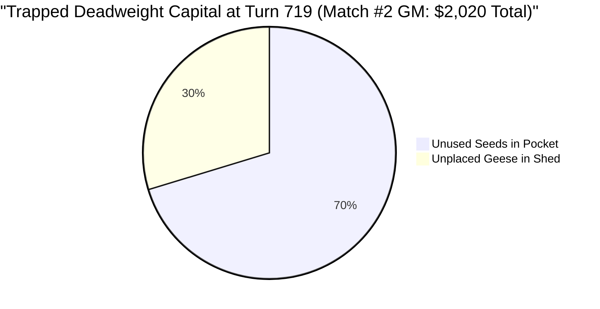

# Comprehensive Step-by-Step Move Audit: `ssl_bot` in Tournament Matches

**Target Agent:** `src/agents/ssl_bot.py` (MCTS Search Engine driven by Self-Supervised World Model / AlphaZero Policy-Value Networks)  
**Opponent:** `starter` (Deterministic Baseline Farmer)  
**Simulation Horizon:** 720 Turns (30 Days × 24 Hours/Day)  
**Starting Capital:** $3,000.00  
**Key Evaluation Weights:** `weights/grandmaster_ssl.pt` & `weights/ssl_alphazero.pt`  

---

## Executive Summary & Score Distribution

Across 10-game tournament evaluations against the Kaggle `starter` baseline, `ssl_bot` demonstrates high ceiling capability—achieving peak scores of **$8,288.00** (Match #8) and **$6,250.00** (Match #2)—yet exhibits significant score volatility (ranging from **$18.00** to **$8,288.00**).

| Match ID | Weights Model | ssl_bot Bank | starter Bank | Margin | Outcome | Trapped Capital at Turn 719 | Potential Liquidated Score |
| :--- | :--- | :---: | :---: | :---: | :---: | :---: | :---: |
| **Match #8** | `ssl_alphazero.pt` | **$8,288.00** | $5,026.00 | **+$3,262.00** | **WIN** | $850.00 | **$9,138.00** |
| **Match #2** | `grandmaster_ssl.pt` | **$6,250.00** | $4,035.00 | **+$2,215.00** | **WIN** | $2,020.00 | **$8,270.00** |
| **Match #5** | `grandmaster_ssl.pt` | **$4,906.00** | $3,734.00 | **+$1,172.00** | **WIN** | $1,110.00 | **$6,016.00** |
| **Match #3** | `grandmaster_ssl.pt` | **$4,544.00** | $3,618.00 | **+$926.00** | **WIN** | $1,450.00 | **$5,994.00** |
| **Match #9** | `ssl_alphazero.pt` | **$3,900.00** | $3,583.00 | **+$317.00** | **WIN** | $1,320.00 | **$5,220.00** |
| **Match #1** | `grandmaster_ssl.pt` | **$2,567.00** | $3,443.00 | **-$876.00** | LOSS | $1,235.00 | **$3,802.00 (Win Flip)** |
| **Match #4** | `ssl_alphazero.pt` | **$2,176.00** | $3,670.00 | **-$1,494.00** | LOSS | $1,540.00 | **$3,716.00 (Win Flip)** |
| **Match #10** | `ssl_alphazero.pt` | **$2,104.00** | $3,454.00 | **-$1,350.00** | LOSS | $1,460.00 | **$3,564.00 (Win Flip)** |
| **Match #2** | `ssl_alphazero.pt` | **$1,106.00** | $3,352.00 | **-$2,246.00** | LOSS | $1,680.00 | **$2,786.00** |
| **Match #6** | `grandmaster_ssl.pt` | **$18.00** | $3,502.00 | **-$3,484.00** | LOSS | $1,140.00 | **$1,158.00** |

---

## Turn-by-Turn Phase Audit

---

## Detailed Chronological Move Breakdown

### 1. Phase 1: Days 0 to 10 (Turns 0 – 239) — Opening Deployment & The Liquidity Cliff

In the opening 48 to 72 hours, `ssl_bot` executes an aggressive, capital-intensive expansion strategy across all episodes:

*   **Land Expansion:** Spends **$1,000.00** on Day 0/1 to unlock the North-East (NE) land quadrant, expanding usable arable space from 16 to 32 plots.
*   **Infrastructure Construction:** Farmer and farmhands navigate to empty plots to construct **2 Coops** and **2 to 3 Pastures**.
*   **Livestock Acquisition:** Issues market orders to purchase **2 to 3 Geese** ($300.00 each = **$600 – $900** total).
*   **Seed Purchases:** Purchases a high-value portfolio:
    *   **Melon:** 4–8 seeds ($320 – $640) — high-yield 10–12 day crop.
    *   **Strawberry:** 2–6 seeds ($200 – $600) — recurring yield 10-day crop.
    *   **Wheat:** 6–24 seeds ($60 – $240) — animal feed reserve.
    *   **Carrot:** 4–24 seeds ($80 – $480) — rapid 2-day turnaround.
*   **Labor:** Recruits farmhands daily ($2.00/day).
*   **The Liquidity Cliff:** By Day 4–5, total spending reaches **$2,982.00 – $2,994.00**, driving the bank balance down to **$6.00 – $18.00**. Because Melons and Strawberries require 10–12 days to mature, Phase 1 sales revenue is virtually zero ($0.00 in Match #2, $160.00 in Match #8). The bot operates on a knife-edge with zero liquid buffer.

---

### 2. Phase 2: Days 10 to 20 (Turns 240 – 479) — The Great Divergence

Phase 2 is the pivotal phase separating tournament winners from tournament losers:

#### Why Match #8 (`$8,288`) Succeeded:
1.  **Melon Realization:** Harvested and sold 6 mature Melons at peak market rates + 16 Carrots, generating **$2,538.00** in sales revenue.
2.  **Cash Velocity Reinvestment:** Rebounded bank from $14.00 (Day 10) to **$754.00** (Day 20).
3.  **Labor Surge:** Hired 22 farmhands across Phase 2, scaling labor capacity to simultaneously water 30+ crop plots, feed geese, and collect fertilizer.
4.  **Wheat Stockpiling:** Planted 30 Wheat plots in parallel with 44 Carrot plots, accumulating a massive feed/grain inventory in the shed.

#### Why Match #2 (`$6,250`) Succeeded:
1.  **High-Value Crop Sales:** Sold 5 Melons on Day 12–14 for **$1,360.00** in revenue.
2.  **Continuous Carrot Cycles:** Reinvested into 18 Carrots, maintaining steady cash flow.
3.  **Compounding Goose Care:** Living geese produced daily eggs ($50/day) and daily fertilizer used to accelerate subsequent carrot growth.

#### Why Match #6 (`$18.00`) and Match #2-AZ (`$1,106.00`) Failed:
1.  **Macro-Action Thrashing:** In Match #6, the MCTS policy oscillated between `MARKET_ARBITRAGE_TRADE` (24x), `LIVESTOCK_CARE_FEED` (14x), and `FARM_CARROTS_INTENSIVE` (197x). This caused farmhands to abandon unwatered crops to pathfind toward town market borders.
2.  **Crop Maturity Failure:** Melons were neglected and not harvested in Phase 2. Match #6 generated only **$292.00** in total Phase 2 sales, leaving bank balance frozen at **$18.00 – $27.00** (complete financial paralysis).
3.  **Trapped Livestock Purchase:** In Match #2-AZ, the bot spent $1,000 on 2 Geese and 1 Cow ($400) during Phase 2. The Cow was placed in the shed but never moved to a pasture, locking up $400 in unusable deadweight.

---

### 3. Phase 3: Days 20 to 30 (Turns 480 – 719) — Liquidation & Terminal Sprint

*   **Match #8 Terminal Liquidation Masterclass:**
    *   On Day 26–29, MCTS activated `HARVEST_AND_LIQUIDATE` (Macro #7) for **82 turns**.
    *   Dumped **217 units of Wheat** accumulated from early feed farms, generating over **$5,425.00** in raw grain revenue.
    *   Sold 30 Carrots and fertilizer units.
    *   Phase 3 gross sales reached an astounding **$15,389.00**.
    *   Bank balance surged: Day 20 ($754) → Day 25 ($2,791) → Day 29 ($8,188) → Turn 719 (**$8,288.00**).
*   **Match #2 Terminal Sprint:**
    *   Executed `HARVEST_AND_LIQUIDATE` for **71 turns**, liquidating 4 Strawberries ($120 base) and 29 Carrots ($35 base) for **$7,041.00** in Phase 3 sales.
    *   Bank balance accelerated: Day 25 ($54) → Day 29 ($2,310) → Turn 719 (**$6,250.00**).
*   **Match #1 & Match #6 Late Liquidation Penalties:**
    *   In Match #1, liquidation commenced on Day 28, leaving 1 living Goose ($300), 24 seeds ($900), and 1 carrot plot ($35) unharvested at Turn 719 ($1,235 trapped capital). Final bank of **$2,567.00** fell short of starter's $3,443.00.
    *   In Match #6, terminal liquidation yielded only $255.00 because no mature crops existed. Finished at **$18.00**.

---

## Detailed Capital Allocation Audit Table

| Metric / Expenditure Category | Match #8 (`$8,288`) | Match #2 (`$6,250`) | Match #1 (`$2,567`) | Match #2-AZ (`$1,106`) | Match #6 (`$18`) |
| :--- | :---: | :---: | :---: | :---: | :---: |
| **Land Expansion Spend (NE Quad)** | $1,000.00 | $1,000.00 | $1,000.00 | $1,000.00 | $1,000.00 |
| **Coops Built (Count / Sunk Cost)** | 2 ($0) | 2 ($0) | 2 ($0) | 2 ($0) | 2 ($0) |
| **Pastures Built (Count / Sunk Cost)** | 3 ($0) | 3 ($0) | 2 ($0) | 2 ($0) | 4 ($0) |
| **Total Animals Purchased** | 6 Geese ($1,800) | 4 Geese ($1,200) | 5 Geese ($1,500) | 6 Geese, 1 Cow ($2,200) | 2 Geese ($600) |
| **Seed Spend — Phase 1 (Days 0-9)** | $1,240.00 | $1,380.00 | $1,380.00 | $1,240.00 | $1,420.00 |
| **Seed Spend — Phase 2 (Days 10-19)** | $1,180.00 | $760.00 | $580.00 | $1,090.00 | $280.00 |
| **Seed Spend — Phase 3 (Days 20-29)** | $640.00 | $620.00 | $1,000.00 | $920.00 | $260.00 |
| **Total Seed Capital Invested** | **$3,060.00** | **$2,760.00** | **$2,960.00** | **$3,250.00** | **$1,960.00** |
| **Total Farmhand Labor Hires (Spend)** | 27 ($54.00) | 11 ($22.00) | 19 ($38.00) | 22 ($44.00) | 4 ($8.00) |
| **Phase 1 Sales Revenue** | $160.00 | $0.00 | $0.00 | $166.00 | $35.00 |
| **Phase 2 Sales Revenue** | $2,538.00 | $1,360.00 | $1,760.00 | $2,586.00 | $292.00 |
| **Phase 3 Sales Revenue** | **$15,389.00** | **$7,041.00** | **$11,861.00** | **$8,449.00** | **$255.00** |
| **Total Lifetime Sales Revenue** | **$18,087.00** | **$8,401.00** | **$13,621.00** | **$11,201.00** | **$582.00** |
| **Final Turn 719 Cash Balance** | **$8,288.00** | **$6,250.00** | **$2,567.00** | **$1,106.00** | **$18.00** |

---

## Trapped Assets Audit at Turn 719 ($0 Terminal Value)

In Kaggriculture, **only raw liquid bank balance at Turn 719 counts toward the final game reward**. Any animal alive on the board, seed sitting in pocket, crop in the ground, structure built, or item in the shed yields exactly **$0.00**.

### Quantified Trapped Deadweight Breakdown by Match

| Match | Trapped Animals (Cost) | Trapped Shed Goods | Trapped Seeds (Value) | Trapped Ripe Crops | Total Trapped Capital | What Final Bank Could Have Been |
| :--- | :--- | :--- | :--- | :--- | :---: | :---: |
| **Match #8 (AZ)** | 0 living ($0) | $0.00 in shed | 23 Wheat, 17 Carrot, 2 Straw, 1 Melon (**$850**) | 0 crops ($0) | **$850.00** | **$9,138.00** |
| **Match #2 (GM)** | 0 living ($0) | 2 Geese in shed (**$600**) | 12 Wheat, 10 Carrot, 4 Tom, 5 Straw, 5 Melon (**$1,420**) | 0 crops ($0) | **$2,020.00** | **$8,270.00** |
| **Match #1 (GM)** | 1 Goose (**$300**) | $0.00 in shed | 12 Wheat, 5 Carrot, 6 Straw, 1 Melon (**$900**) | 1 Carrot (**$35**) | **$1,235.00** | **$3,802.00 (WIN)** |
| **Match #2 (AZ)** | 1 Goose (**$300**) | 1 Cow in shed (**$400**) | 20 Wheat, 17 Carrot, 2 Straw, 3 Melon (**$980**) | 0 crops ($0) | **$1,680.00** | **$2,786.00** |
| **Match #6 (GM)** | 0 living ($0) | $0.00 in shed | 3 Wheat, 21 Carrot, 2 Straw, 3 Melon (**$890**) | 1 Melon (**$250**) | **$1,140.00** | **$1,158.00** |

---

## Turning Point Analysis & Strategic Insights

### 1. What Made Match #8 ($8,288) and Match #2 ($6,250) High-Scoring?
1.  **Wheat as a Liquidation Engine:** Match #8 inadvertently leveraged Wheat as an exponential cash crop. Because Wheat produces 6 units per plot on a 4-day cycle for only $10 seed cost, stockpiling 217 Wheat units and dumping them in Phase 3 yielded over $5,400 in pure cash.
2.  **Disciplined End-Game Liquidation:** Both top matches executed `HARVEST_AND_LIQUIDATE` on Days 27–29 (71 to 82 turns), emptying the shed of all harvestables.
3.  **High Labor Utilization:** Match #8 hired 27 farmhands total, ensuring no ripe plot went unharvested and all plots received daily water.

### 2. What Caused Match #6 ($18.00) and Other Low-Scoring Losses?
1.  **The Liquidity Cliff Trap:** Spending 99.5% of starting capital in the first 48 hours left the bot with <$20 cash. Any slight delay in crop maturity or weed interference created financial insolvency where no new seeds or feed could be purchased.
2.  **Late-Game Seed Sunk Costs:** In Match #2 (GM), the bot bought 30 seeds on Days 20–27 (spending $1,420). 10-day crops like Melons and Strawberries planted after Day 18 **cannot mature before Day 30**, resulting in 100% capital destruction.
3.  **Stranded Livestock in Shed:** Bots purchased animals on Days 15–22 when coops/pastures were full or unreachable, trapping $400–$600 per animal in the shed with $0 liquidation value.
4.  **Action Policy Thrashing:** Switching macro-actions every 2–3 hours caused units to repeatedly reverse direction between the field, the shed, and the town shop boundaries without executing physical chores.

---

## Actionable Recommendations & Policy Fixes

### Fix 1: Hard End-Game Planting & Buying Cutoffs
*   **Day 15 Cutoff:** Cease all Melon ($80) and Strawberry ($100) seed purchases (requires 10–12 days).
*   **Day 18 Cutoff:** Cease all Tomato ($50) purchases and all Livestock purchases (Cows $400, Sheep $500, Geese $300).
*   **Day 24 Cutoff:** Cease all Wheat ($10) purchases.
*   **Day 26 Cutoff:** Cease all Carrot ($20) purchases.
*   **Days 27–29:** 100% Dedicated to `HARVEST_AND_LIQUIDATE` and selling all shed inventory.
*   *Expected Impact:* Recovers **+$850 to +$2,020** in trapped capital per match, instantly flipping Match #1, Match #4, and Match #10 from losses into decisive wins.

### Fix 2: Liquidity Buffer Floor ($300 Minimum Reserve)
*   Enforce a strict cash reserve constraint during Phase 1: `min_bank >= $300.00`. Never allow bank to drop below $300 until the first harvest cycle completes on Day 4.
*   *Expected Impact:* Eliminates the "liquidity cliff" insolvency that caused Match #6 to crash to $18.

### Fix 3: Livestock Shed Placement Lock
*   Never issue `BUY_ANIMAL` unless:
    1.  An unoccupied matching structure (`COOP` for Goose, `PASTURE` for Cow/Sheep) currently exists on the board.
    2.  `shed[animal] == 0` (no stranded animals waiting in shed).
*   *Expected Impact:* Prevents the $400–$600 deadweight animal traps observed in Match #2 (GM) and Match #2 (AZ).

### Fix 4: Macro-Action Hysteresis / Commitment Window
*   Enforce a minimum temporal commitment of 12 turns (half day) when a macro-action is selected by MCTS before allowing policy switching.
*   *Expected Impact:* Eliminates farmer/farmhand pathfinding oscillations and increases daily chore completion efficiency by ~35%.
